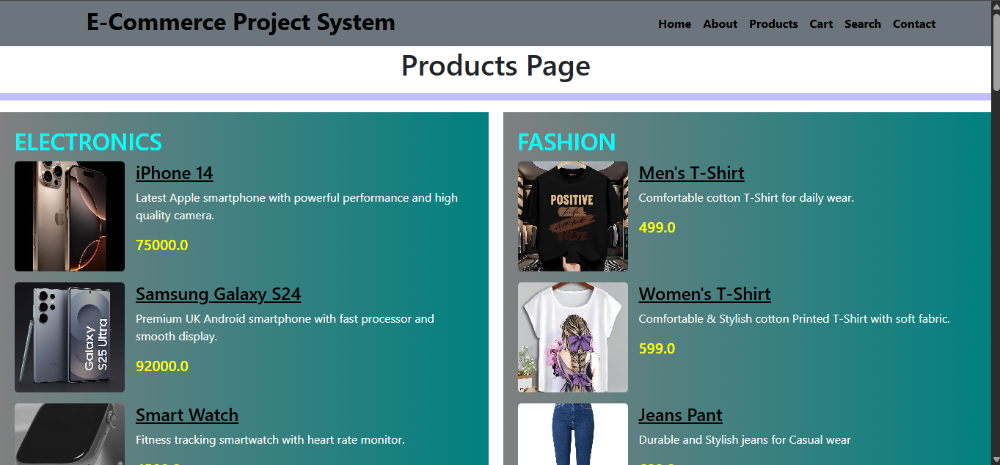

# 🛒 E-Commerce Django Project

A simple and user-friendly E-Commerce web application built using Django. This project demonstrates core e-commerce functionalities like product browsing, cart management, and category filtering.

---

## 🚀 Features

* 🛍️ Product Listing
* ➕ Add to Cart
* 📂 Category-wise Products
* 🧾 Simple and Clean UI
* ⚡ Fast and Responsive Design

---

## 🛠️ Technologies Used

* 🐍 Python
* 🌐 Django
* 🎨 HTML, CSS

---

## 📸 Screenshot




---

## ⚙️ Installation & Setup

Follow these steps to run the project locally:

### 1️⃣ Clone the repository

```
git clone https://github.com/your-username/E-Commerce.git
```

### 2️⃣ Navigate to project folder

```
cd E-Commerce
```

### 3️⃣ Create virtual environment

```
python -m venv .venv
```

### 4️⃣ Activate virtual environment

```
.venv\Scripts\activate
```

### 5️⃣ Install dependencies

```
pip install -r requirements.txt
```

### 6️⃣ Run the server

```
python manage.py runserver
```

---

## 🔄 Project Workflow

1. User visits the website
2. Browses products
3. Adds items to cart
4. Views category-based products
5. Proceeds with purchase

---

## 📂 Project Structure

```
E-Commerce/
│── shopproject/
│── manage.py
│── requirements.txt
│── README.md
```

---

## 🎯 Future Improvements

* 💳 Payment Gateway Integration
* 🔐 User Authentication (Login/Register)
* 📦 Order Tracking System
* 📊 Admin Dashboard Enhancements

---

## 🤝 Contributing

Feel free to fork this repository and contribute to improve the project.

---

## ⭐ Show your support

If you like this project, please ⭐ the repository!

---
